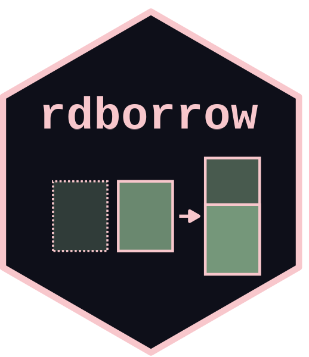

# rdborrow 

<!-- badges: start -->
[](https://github.com/Genentech/rdborrow/actions/workflows/R-CMD-check.yaml)
<!-- badges: end -->

## Installation

Install the released version from CRAN:

```r
install.packages("rdborrow")
```

Or install the development version from GitHub:

```r
# install.packages("pak")
pak::pak("Genentech/rdborrow")
```

## Documentation

- [Package website](https://genentech.github.io/rdborrow/)
- [Getting started](https://genentech.github.io/rdborrow/articles/)
- [Function reference](https://genentech.github.io/rdborrow/reference/)

## How to cite the manuscript

Shi L, Pang H, Chen C, Zhu J. rdborrow: an R package for causal inference incorporating external controls in randomized controlled trials with longitudinal outcomes. *J Biopharm Stat*. 2025 Oct;35(6):1043-1066. doi: [10.1080/10543406.2025.2489283](https://doi.org/10.1080/10543406.2025.2489283). PMID: 40296214.

```
@article{shi2025rdborrow,
  title = {rdborrow: an R package for causal inference incorporating external controls in randomized controlled trials with longitudinal outcomes},
  author = {Lei Shi and Herbert Pang and Chen Chen and Jiawen Zhu},
  journal = {Journal of Biopharmaceutical Statistics},
  year = {2025},
  volume = {35},
  number = {6},
  pages = {1043--1066},
  doi = {10.1080/10543406.2025.2489283}
}
```

## How to cite the package

Shi L, Secrest MH, Pang H, Chen C, Zhu J (2026). rdborrow: An R package for Causal Inference Incorporating External Controls in Randomized Trials with Longitudinal Outcomes. R package version 0.0.4.0, https://genentech.github.io/rdborrow/.

```
@Manual{,
  title = {rdborrow: An R package for Causal Inference Incorporating External Controls in Randomized Trials with Longitudinal Outcomes},
  author = {Lei Shi and Matthew H Secrest and Herbert Pang and Chen Chen and Jiawen Zhu},
  year = {2026},
  note = {R package version 0.0.4.0},
  url = {https://genentech.github.io/rdborrow/}
}
```
